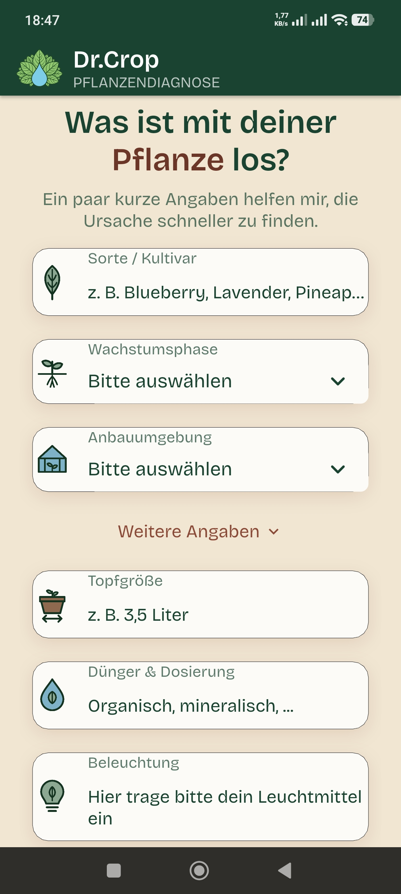
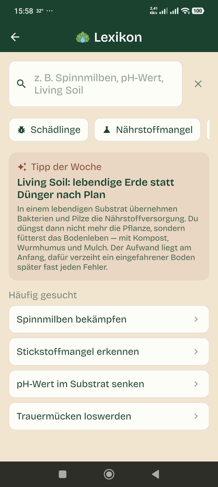
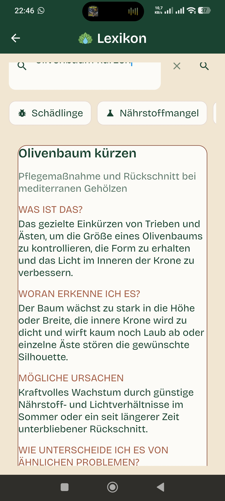

# Dr. Crop — The Intelligent Botanical Co-Pilot

A next-generation mobile app transforming images into precise, actionable
plant diagnoses. Powered by a curated expert knowledge base and advanced AI,
it is built for scale and real-world impact. The system was architected,
developed, and optimized with a relentless focus on scalable solutions, built
from the ground up using coding agents for advanced code generation. My value
lies in product-centric systems thinking, translating complex data into
elegant UX, and driving iteration with measurable metrics. Code is the engine,
and I am the navigator, leveraging powerful tools to engineer intelligent
growth.

The application delivers instant AI-driven analysis by pairing uploaded photos
with symptom descriptions to generate precise diagnoses backed by in-depth,
verified botanical articles. Beyond immediate problem-solving, it acts as a
long-term monitor by generating historical records of every diagnosis to
meticulously track plant health over time. This repository provides a
comprehensive look into the codebases, API integrations, and core FlutterFlow
components that make this botanical synthesis possible.

---

## What the app does

| | |
|---|---|
| **Diagnosis** | Upload a photo, describe the problem (typing or dictation) — diseases, deficiencies, pests |
| **Reference library** | Structured articles on any cultivation topic, from the same knowledge base |
| **History & plant records** | Every diagnosis creates a record; a later photo shows the comparison |
| **Memory (Pro)** | The assistant remembers strain, substrate and earlier problems |

Home · Reference library · Article — every field on the home screen is
optional; you can go straight to the chat. Interface language is German,
the app's target market.

**Stack:** FlutterFlow front end, Firebase Cloud Functions (Node, Frankfurt
region), Google Gemini as the language model, Gemini File Search as the
knowledge base, Firestore for user data and history.

→ [Architecture in detail](docs/architecture.md)

---

## Four things I'm proud of

### 1. I built the RAG pipeline as a fact store, not a text dump

Most retrieval systems drop documents into a vector store and retrieve the
nearest passages. This one distills every source document into **atomic,
domain-tagged facts** first, and retrieves those.

That moves work from retrieval time to build time: every retrieved line is a
checkable claim instead of a paragraph carrying whatever surrounded it, and
retrieval can be filtered by domain. The price is a build pipeline that has to
be policed — which is exactly why the verification stack below exists.

Three measurements shaped it, and two of them killed an assumption of mine:

- **Retrieval was 70% of the cost**, not the model. Almost every cost
  discussion about LLM apps starts at the model; here that would have
  optimised the wrong 11%.
- **The retrieval-size parameter barely works** — 17% between its smallest and
  largest setting, with a hard floor. Knowing a lever is fake is worth as much
  as finding a real one.
- **Cross-lingual retrieval just worked.** Untranslated facts still produced
  fluent, correct answers in the user's language — so a translation step I had
  already built got deleted again.

→ [How the pipeline is built and what it cost](docs/rag-pipeline.md)

### 2. I halved the running costs — measured, not estimated

"What does a user cost me?" isn't a question you can guess at. So I measured
it: real API calls, real token counts.

A typical diagnosis consumes **38,130 tokens**. The breakdown was the
surprise:

| Item | Tokens | Share of cost |
|---|---:|---:|
| Retrieved passages from the knowledge base | 20,345 | **~70%** |
| System prompt (largely cached) | 17,076 | ~11% |
| Response | 709 | ~20% |

The model wasn't the expensive part — *retrieval* was. And a conversation
rarely consists of nothing but new topics: after the initial description come
follow-ups ("how often?", "and in coco?") that need no new source material.
The model already has its previous answer in context.

So: the knowledge base is only queried when it's actually needed — on the
first message, when new photos arrive, when a symptom is named.

**Result: 48% lower cost per user.** A follow-up costs 66% less, a
four-message conversation half as much. Response time dropped from 5.5 to
2.6 seconds as a side effect.

→ [The full cost analysis](docs/cost-optimisation.md) ·
→ [The code](sample-code/wissensbedarf.js)

### 3. I found a pipeline that was quietly producing bad data

A local processing chain turns a large document corpus into a searchable
collection of facts. It had been running for weeks, apparently fine.

Checking it properly surfaced seven faults side by side:

- **Documents were processed repeatedly.** The resume logic compared a trimmed
  name against an untrimmed one — for folder names ending in a space, the
  comparison *always* failed. Two documents sat in the output file three times
  over. The next run would have redone 9 of 13.
- **An aborted run counted as finished.** The "done" marker was written
  *before* processing. One document stayed permanently at 11 facts out of
  several thousand.
- **One scan had captured 15 of 217 pages** — and nobody had ever checked
  whether the page count matched.

The common thread: **the pipeline checked whether a step had *run* — never
whether the result was *right*.**

That became a five-stage verification tool that checks against the source
rather than against itself: PDF page count against pages actually processed,
completeness against freshly recomputed sections, fact quality against fixed
rules.

It immediately surfaced more: **191 facts that pointed back at their source**
(phrasing that would have leaked into user-facing answers), 8,053 duplicates,
11% of entries never translated.

→ [How the quality assurance works](docs/quality-assurance.md) ·
→ [Sample code](sample-code/)

### 4. I verify the solutions too — especially my own

While building the safety mechanisms I found three bugs in *my own* checks,
each one only because I measured instead of assuming:

- An abort guard that **did nothing** — in shell, `if ! command; then
  status=$?` returns the value of the *negation*, never the real exit code.
  The mechanism *looked* like it worked.
- A completeness check that produced **five false alarms**, because it
  stripped leading special characters too crudely and landed inside an image
  embed.
- A coverage check that **reported a gap that didn't exist** — it searched
  for "giessen" while the data spells it "gießen". Reported: 3 facts.
  Actual: 96.

The last one matters most to me: **a falsely reported gap is just as harmful
as a missed one.** It sends someone hunting for a problem that isn't there.
Both cases are now documented as rationale in the code, so nobody
"simplifies" the check later.

---

## Product decisions with numbers behind them

**Pricing.** Asked whether €4.99 would do, I didn't answer by feel — I ran the
numbers: it covers costs comfortably (8% cost ratio), but €4.99 needs **40%
more paying users** for the same revenue, and it collapses the existing price
ladder, because the 4-month bundle would then cost *more* than paying
monthly. Conclusion: keep the list price, use an introductory discount
instead.

**Abuse protection.** Added after the cost analysis: per-minute rate limit,
daily and monthly caps, server-side photo limit. In the process it turned out
that one endpoint had **no limits at all** — any signed-in user could trigger
unlimited searches.

**A weakness named openly.** The app uses anonymous sign-in, which means the
free quota can be reset by reinstalling. That's not negligence but a
deliberate trade-off between friction and protection — and it belongs on the
table, not swept under it.

---

## What deliberately isn't here

- **The system prompt** (77,000 characters) — the product's core know-how
- **The knowledge base** — the source corpus and everything derived from it
- **Credentials of any kind**

The sample code here is real, production code from the project, merely
selected. The full repositories are private; happy to walk through them in
conversation.

---

## Contact

I'm looking for work at the intersection of **product, AI automation and
engineering** — where someone needs to think a project through, build it with
AI tools, and check the results critically.

If you want to know why a particular decision in this project went one way
and not another: ask me. I can justify every single one.

**[LinkedIn: Philipp Boris Magnus Stapelfeld](https://www.linkedin.com/in/philipp-boris-magnus-stapelfeld-262167131)**
— you'll also find what I can be hired for there.

**GitHub:** [boristap](https://github.com/boristap)
